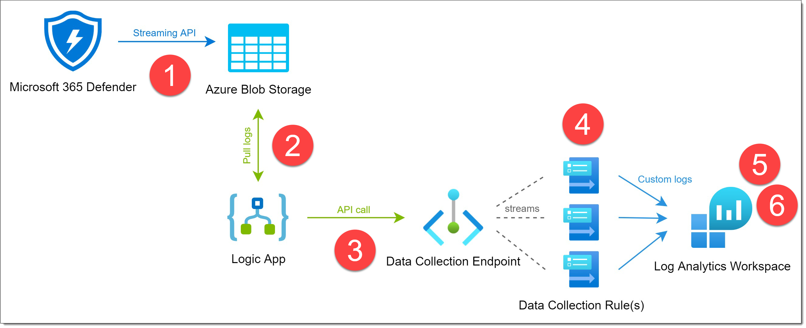

# Introduction

**This repository is referred to by one of my articles on Medium**

> Although you have some data retention options for 365 Defender, with a maximum of 180 days these are way more limited than what we’re used to compared to Sentinel. And for your raw logs, used for Advanced Hunting or more advanced triage and investigations, you are even more limited. These are only stored for 30 days, regardless what setting you choose for global data retention.

> Unfortunately `raw` data for Advanced Hunting and investigations is only available for 30 days
Recently Microsoft announced new tiers for storing data in Sentinel into public preview: Basic and Archive log tiers. These new tiers accommodate for more elaborate retention requirements as well as control over ingest costs.

> So how do the three different log tiers differ from each other? What new capabilities and limits are newly available? And most importantly (for this article at least): Can we also ingest raw data from Microsoft 365 Defender in the new Archive tier as well? And can we also leverage the benefits of Basic logs in between, to minimize costs as well?

> These are the questions I’ll be answering in this article. But since I had a lot of ground to cover, I split the article into two distinct sections:

> __Part 1__ | Introduction to new log tiers

> – Basic and Archive log tier details

> – New custom log ingestion method with Data Collection Endpoints

> __Part 2__ | Archiving Microsoft 365 Defender logs

> – Downsides and limitations of the integrated M365 data connector

> – Use Logic App to ingest 365 Defender data as custom logs into Basic table

 

__Read the ful article by following the links below:__

__Part 1:__ https://medium.com/wortell/use-sentinel-basic-and-archive-logs-fae3bb3a6299

__Part 2:__ https://medium.com/@koosg/archive-microsoft-365-defender-logs-de531161dc25

 

# Overview

1. By using the streaming API feature of Microsoft 365 Defender we can stream all logs to blob containers on an Azure Storage Account. We only need to store the data there for a couple of days, so the added costs within this setup is quite low.
2. An Azure Logic app will query the blob containers on a daily basis to collect all logs from the previous day.
3. Next, it’ll construct a proper API call to push all of the log entries to a Data Collection Endpoint with the relevant stream name.
4. Because of a stream count limit of 10 (more on this later in part #2 of this article) per Data Collection Rule, we need multiple DCR’s; one for every table to be exact.
5. Custom logs are flowing into Sentinel/Log Analytics where the tables can be configured to use Basic logs. Besides of the _CL table name suffix, nothing within your KQL queries need to be changed. All column names stay exactly the same thanks to this new custom logs ingestion method.
6. After 8 days data will be moved to Archive logs where it can be retained for up to seven years. In case of a major security incident, you can search your logs are restore parts of it for further forensic investigation if needed.

 

# Get started!

This automated deployment will deploy the Logic App, together with all of the other required resources, as it was used in all the examples in the article.

__To deploy this set of resources, click the button below:__

 

 

The template will deploy the following resources:

| Resource Type | Details |
| ---- | ---- |
| Microsoft.Operationalinsights/workspaces | The Log Analytics workspace where all logs from Microsoft 365 Defender will be archived |
| Microsoft.OperationalInsights/workspaces/tables | All custom table (17x) definitions where the schema is properly determined as well as the Basic tier |
| Microsoft.Insights/dataCollectionEndpoints | Data Collection Endpoint used for custom log ingestion. This is where the Logic App sends the data to. |
| Microsoft.Insights/dataCollectionRules | One Data Collection Rule per table name to work around maximum 'stream' limit of ten per DCR. Each DCR also contains the transformation query. |
| Microsoft.Storage/storageAccounts | Storage Account which will be used to temporarily store de logs from Microsoft 365 Defender via the streaming API. |
| Microsoft.Storage/storageAccounts/blobServices | Some blob storage configurations like network ACLs and data retention settings. |
| Microsoft.Logic/integrationAccounts | An Integration Account is required to be able to run Javascript tasks within Logic Apps. |
| Microsoft.Web/connections | Logic App Connector to communicate with the Storage Account via system-assigned Managed Identity. |
| Microsoft.Logic/workflows | The Logic App workflow where als retrieval, parsing, and sending of data will take place every day at 02:00 CET. |
| Microsoft.Authorization/roleAssignments | The system-assigned Managed Identity from the Logic App need to be granted two specific RBAC roles to retrieve data from the Storage Account and send data to the Data Collection Endpoint. |

 